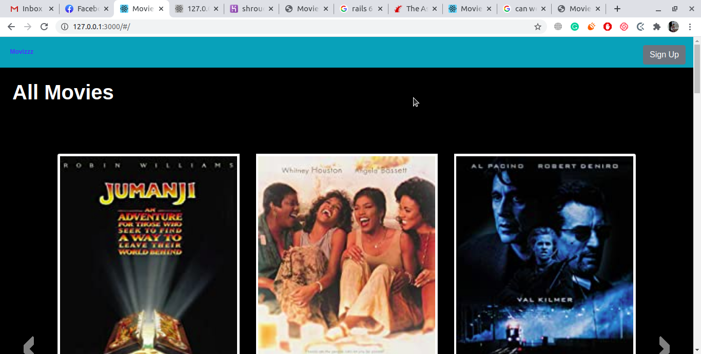

# Moviezz

- This is a Movizz recomendation system, where You can check the movies against stas and geners and like movise as well.
# What it does
- Sign up
- Sign in
- Change Password
- Like movie
- Like a actor
- Movies againse actor
- Movies against Geners
# Built With
- Ruby
- Ruby on Rails
- Graphql
- Vue Js
- Heroku
- VSCode

## Live Demo

[Live Demo Link](https://shrouded-waters-94337.herokuapp.com/#/)

## Presentation

[presentation]()

## Author

👤 **Tahir Ahmad**

- Github: [@tahirbhalli](https://github.com/Tahirbhalli)
- Twitter: [@tahirbhalli](https://twitter.com/tahirbhalli)
- Linkedin: [Tahir Ahmad](https://www.linkedin.com/in/tahir-ahmad-483035164/)

# 🤝 Contributing
Contributions, issues and feature requests are welcome!

# Show your support
Give a ⭐️ if you like this project!

📝 License

Check out my stories on medium to see what I'm talking about! Follow me on Instagram and Twitter to see what I am up to!

Enjoy!